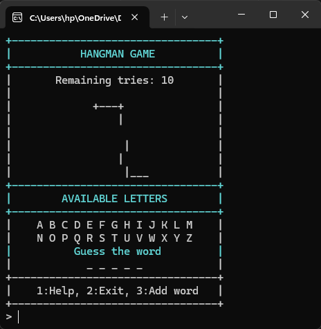

# Jeu du Pendu en C++

## Description
Ce projet est une implémentation du jeu du Pendu en C++. L'objectif du jeu est de deviner un mot en proposant des lettres une à une avant d'atteindre la limite d'erreurs autorisée (10 tentatives).

Le jeu intègre des fonctionnalités telles que :
- Affichage du pendu au fur et à mesure des erreurs
- Système de coloration console (compatible Windows et Linux)
- Chargement aléatoire de mots depuis un fichier
- Possibilité d'ajouter de nouveaux mots
- Options d'aide et d'abandon

## Prérequis
- Un compilateur C++ (g++ ou MSVC)
- Un terminal supportant l'affichage ANSI (pour Linux/macOS)

## Compilation et Exécution

### Windows
Utilisez MinGW ou MSVC pour compiler le programme :
```sh
 g++ -o hangman.exe hangman.cpp
 ./hangman.exe
```

### Linux/macOS
```sh
g++ -o hangman hangman.cpp
./hangman
```

## Fonctionnalités
- **Jeu interactif** : Les joueurs peuvent deviner des lettres une à une.
- **Affichage dynamique** : Le pendu s'affiche progressivement selon les erreurs.
- **Gestion des couleurs** : Les lettres correctes et incorrectes s'affichent en différentes couleurs.
- **Système de dictionnaire** : Le programme charge des mots depuis un fichier `words.txt`.
- **Ajout de mots personnalisés** : Option pour ajouter de nouveaux mots à la base de données.
- **Aide** : Une option d'aide explique les règles du jeu et permet de révéler une lettre.

## Utilisation
1. Lancez le programme.
2. Devinez le mot caché en tapant une lettre.
3. Vous avez un maximum de 10 erreurs avant de perdre.
4. Vous pouvez accéder à l'aide ou ajouter de nouveaux mots.
5. Une fois la partie terminée, vous pouvez rejouer ou quitter.

## Ajout de mots personnalisés
Si vous souhaitez ajouter de nouveaux mots, vous pouvez :
- Les entrer via l'option dans le jeu.
- Ajouter manuellement des mots au fichier `words.txt` (un mot par ligne).

## Capture d'écran
[Deuxième aperçu](images/hangman_game1.png)[Troisième aperçu](images/hangman_game2.png)

## Auteur
Ce projet a été réalisé par [Votre Nom].

## Licence
Ce projet est sous licence MIT.
